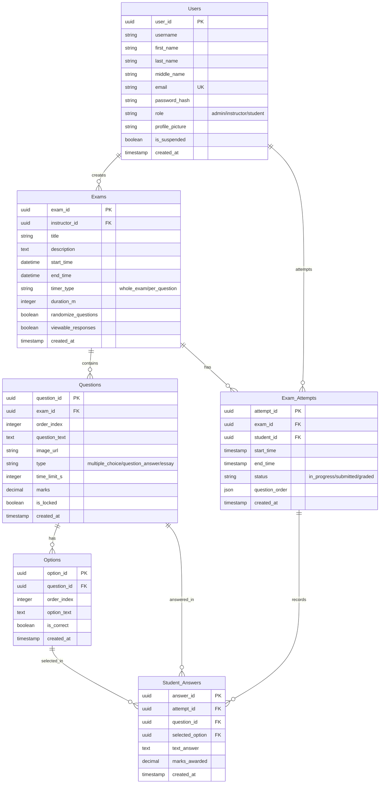

# SkillCheck Database ERD

This document outlines the entity-relationship diagram (ERD) and detailed table definitions for the SkillCheck exam platform database schema.

---

## Detailed Table Schemas

### 1. `Users`
Stores authentication credentials, user profiles, and roles within the application.
- **`user_id`**: Primary Key (UUID).
- **`username`**: Unique handle for authentication.
- **`first_name`**, **`last_name`**, **`middle_name`**: User's parsed name fields.
- **`email`**: User's unique email.
- **`role`**: Users are restricted to `'admin'`, `'instructor'`, or `'student'`.
- **`is_suspended`**: Tracks suspension status.

### 2. `Exams`
Stores assessment details configured by instructors.
- **`exam_id`**: Primary Key (UUID).
- **`instructor_id`**: Foreign Key linking to the `Users` table (the creator).
- **`timer_type`**: Designates whether the exam timer is `'whole_exam'` or `'per_question'`.
- **`duration_m`**: The total exam limit in minutes. Null for per-question timed exams.
- **`randomize_questions`**: Flag to shuffle question delivery order for students.
- **`viewable_responses`**: Flag to allow students to review details after grading.

### 3. `Questions`
Individual questions associated with an exam.
- **`question_id`**: Primary Key (UUID).
- **`exam_id`**: Foreign Key linking to the `Exams` table.
- **`type`**: Supports `'multiple_choice'`, `'question_answer'` (short answer), or `'essay'`.
- **`time_limit_s`**: The time limit in seconds for the question. Required if `timer_type` is `'per_question'`.
- **`marks`**: Point value of the question.

### 4. `Options`
Predefined options for multiple-choice questions or correct answer strings for short-answer questions.
- **`option_id`**: Primary Key (UUID).
- **`question_id`**: Foreign Key linking to the `Questions` table.
- **`is_correct`**: Flag designating whether this option is a correct answer.

### 5. `Exam_Attempts`
A student's session taking a specific exam.
- **`attempt_id`**: Primary Key (UUID).
- **`exam_id`**: Foreign Key linking to the `Exams` table.
- **`student_id`**: Foreign Key linking to the `Users` table (the examinee).
- **`status`**: Current status: `'in_progress'`, `'submitted'`, or `'graded'`.
- **`question_order`**: JSON list tracking the exact random/sequential order of questions served to the student.

### 6. `Student_Answers`
Individual question responses recorded under a specific attempt.
- **`answer_id`**: Primary Key (UUID).
- **`attempt_id`**: Foreign Key linking to the `Exam_Attempts` table.
- **`question_id`**: Foreign Key linking to the `Questions` table.
- **`selected_option`**: Foreign Key linking to the `Options` table (for multiple choice).
- **`text_answer`**: Text response (for essays or short answers).
- **`marks_awarded`**: Score given for the answer (auto-graded for MCQs/QAs, manually graded for essays).
